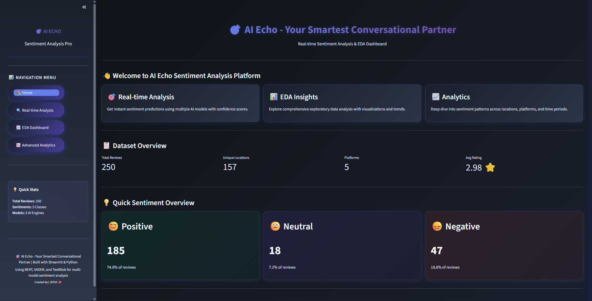
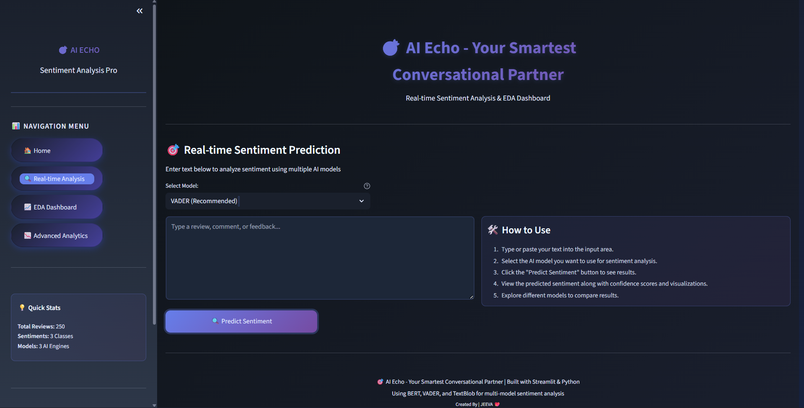
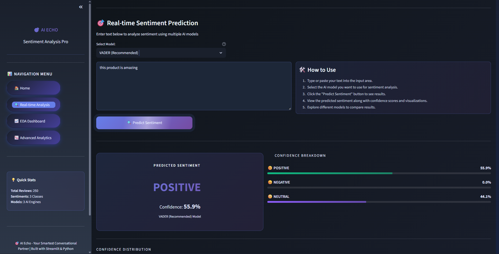
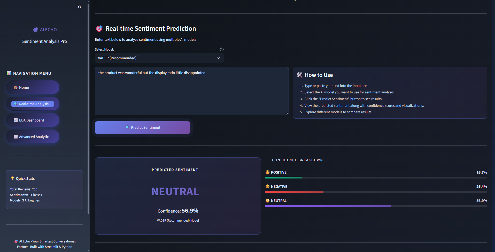
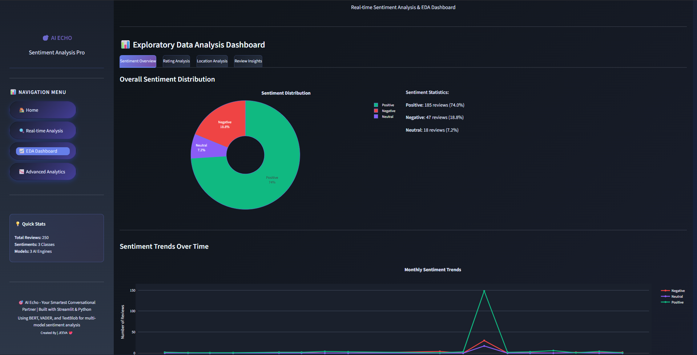
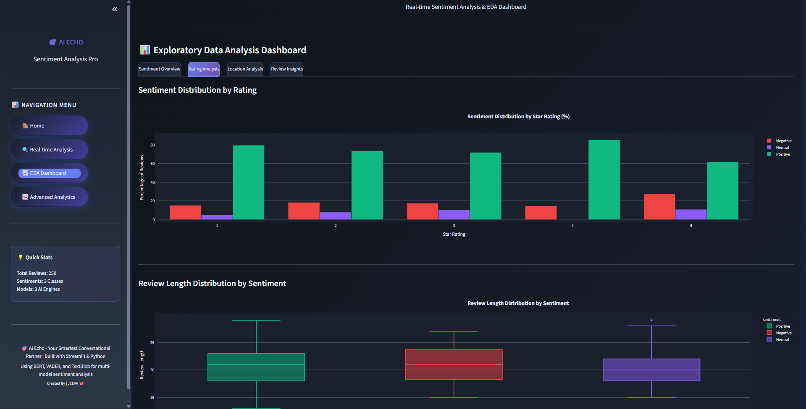
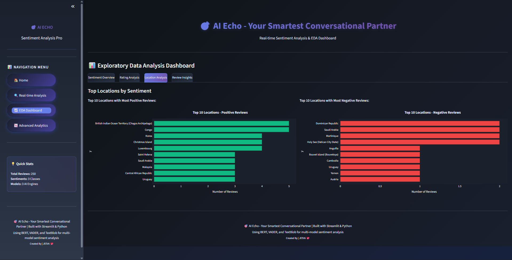
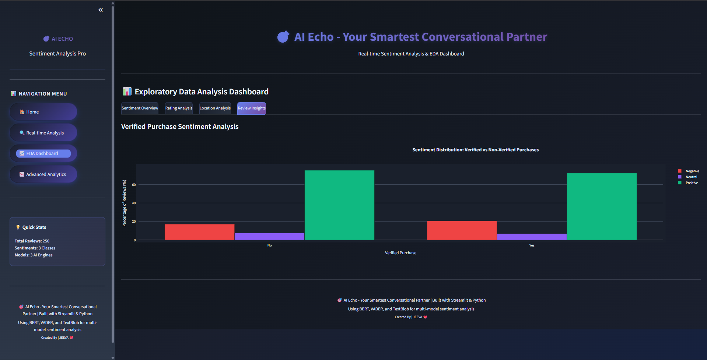
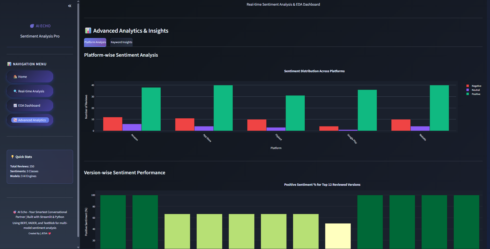
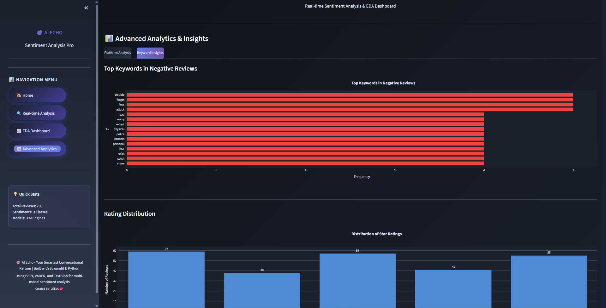

# 🎯 AI Echo - Your Smartest Conversational Partner

A powerful, multi-model sentiment analysis platform built with Streamlit, featuring real-time predictions, exploratory data analysis, and advanced analytics using VADER, TextBlob, and BERT models.

---
## 🔗 Links

- 🌐 **Live Demo**:https://ai-echo-your-smartest-conversational-partner-cwpu4nxmhgueaqkk5.streamlit.app
- 📖 **Documentation**: See inline code comments
---

## ✨ Features

### 🏠 **Home Dashboard**
- Quick sentiment overview with distribution charts
- Dataset statistics (total reviews, locations, platforms, average rating)
- Sentiment breakdown with visual cards



### 🔍 **Real-time Sentiment Analysis**
- Multi-model sentiment prediction (VADER, TextBlob, BERT)
- Confidence scores and breakdown visualization
- Interactive bar and donut charts
- Real-time text input analysis



**Prediction 1**


**Prediction 2**


**Visuals**


### 📊 **EDA Dashboard**
- **Sentiment Overview**: Distribution trends and monthly sentiment trends
- **Rating Analysis**: Sentiment by star rating, review length distribution
- **Location Analysis**: Top locations by positive/negative sentiment
- **Review Insights**: Verified purchase sentiment comparison

**Tag 1**


**Tag 2**


**Tag 3**


**Tag 4**


### 📈 **Advanced Analytics**
- Platform-wise sentiment distribution
- Version-wise sentiment performance
- Keyword analysis from negative reviews
- Rating distribution visualization

**Tag 1**


**Tag 2**


---

## 🚀 Quick Start

### Local Installation

1. **Install dependencies**
```bash
pip install -r requirements.txt
```

2. **Place your data file**
- Ensure `cleaned_review.csv` is in the project root or `data/` folder
- Required columns: `location`, `platform`, `rating`, `sentiment`, `date`, `review_length`, `processed_reviews`, `version`, `verified_purchase`

4. **Run the app**
```bash
streamlit run streamlit_app.py
```

The app will open at `http://localhost:8502`

---

## 📦 Project Structure

```
ai echo/
├── streamlit_app.py          # Main application
├── cleaned_review.csv        # Dataset (place in root or data/ folder)
├── requirements.txt          # Python dependencies
├── .streamlit/
│   └── config.toml          # Streamlit Cloud configuration
├── style.css                # Custom styling
├── eda.py                   # EDA utilities
└── docs/
    └── images/              # Screenshot placeholders
        ├── banner.png
        ├── home-dashboard.png
        ├── real-time-analysis.png
        ├── eda-dashboard.png
        └── advanced-analytics.png
```

---

## 📋 Data Requirements

Your `cleaned_review.csv` should contain these columns:

| Column | Type | Description |
|--------|------|-------------|
| `location` | string | Review location |
| `platform` | string | Platform (Amazon, Flipkart, etc.) |
| `rating` | int | Star rating (1-5) |
| `sentiment` | string | Sentiment class (Positive, Negative, Neutral) |
| `date` | datetime | Review date |
| `review_length` | int | Length of review |
| `processed_reviews` | string | Cleaned/processed review text |
| `version` | string | Product version |
| `verified_purchase` | bool | Verified purchase flag |

---

## 🤖 Sentiment Analysis Models

### VADER (Recommended)
- ⚡ Fast, rule-based sentiment analyzer
- 📊 Works well for social media & reviews
- ✅ No heavy dependencies

### TextBlob
- 🎯 Lightweight polarity-based analysis
- 📚 Uses pre-trained models
- 🔄 Graceful fallback when others fail

### BERT (Optional)
- 🧠 Deep learning-based transformer model
- 🎓 Most accurate but requires `transformers` package
- ⚠️ Falls back to TextBlob on Cloud if not installed

---

### Configuration
The `.streamlit/config.toml` file is pre-configured for Cloud:
- ✅ Dark theme matching your UI

## 🎨 Theme & Customization

The app uses a **dark gradient theme** with:
- Primary color: `#667eea` (purple)
- Background: `#0f1419` (dark blue)
- Accent colors for sentiment: 
  - 🟢 Positive: `#10b981`
  - 🔴 Negative: `#ef4444`
  - 🟣 Neutral: `#8b5cf6`

Edit the CSS in `streamlit_app.py` to customize colors and styling.

---

## 📚 Dependencies

See `requirements.txt` for all packages:
- **streamlit**: Web framework
- **pandas, numpy**: Data processing
- **plotly**: Interactive visualizations
- **scikit-learn**: ML utilities
- **nltk, textblob, vaderSentiment**: Sentiment analysis
- **matplotlib, seaborn**: Static visualizations

Optional (for BERT support):
```bash
pip install transformers torch
```

---

## 👨‍💻 Author

Built with ❤️ for sentiment analysis enthusiasts.
Created By Jeeva❤️

**Last Updated**: December 28, 2025

---

**Happy Analyzing! 🎯**
